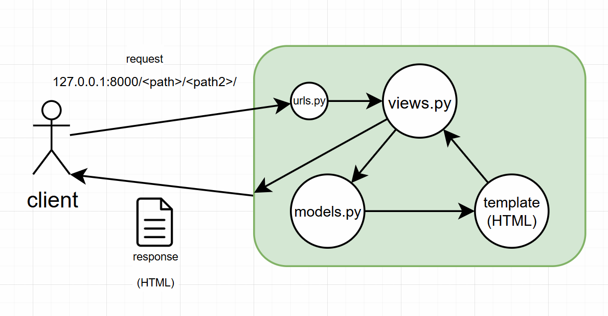

# Django

## 0. setting

- `.gitignore`
- `python -m venv venv`
- `README.md`

## 1. Django 프로젝트

1. django 설치
```shell
pip install django
```

2. 프로젝트 생성
```shell
django-admin startproject <pjt-name> <path>
django-admin startproject first_pjt .
```

3. 서버실행 (종료: `ctrl + c`)
```shell
python manage.py runserver
```

4. 앱 생성
```shell
django-admin startapp <app-name>
django-admin startapp first_app
```

5. 앱 등록 (`settings/py`)
```python
INSTALLED_APPS = [
    ...,
    '<app-name>',
    'first_app',
]
```

6. urls.py → views.py → templates/

---
- MTV

*MVC = MTV: 디자인 패턴(비슷한 것끼리 묶기)*

*db/html/python*



- 코드박스

*shell = terminal*

- startproject

*manage.py: command-line utility*

*firs_pjt/: project folder*

*first_pjt/__init__.py: python package*

*first_pjt/settings: setting*

*first_pjt/urls: table of contents*

- 링크

*127.0.0.1: 내 컴퓨터를 나타내는 숫자*

*8000: 포트 번호*

- startapp

*first_app/: app folder*

*first_app/models.py: MTV의 m(DB)*

*firs_app/views.py: MTV의 v(Python)*

*templates/: MTV의 t(html)*

- bootstrap

*Include via CDN*